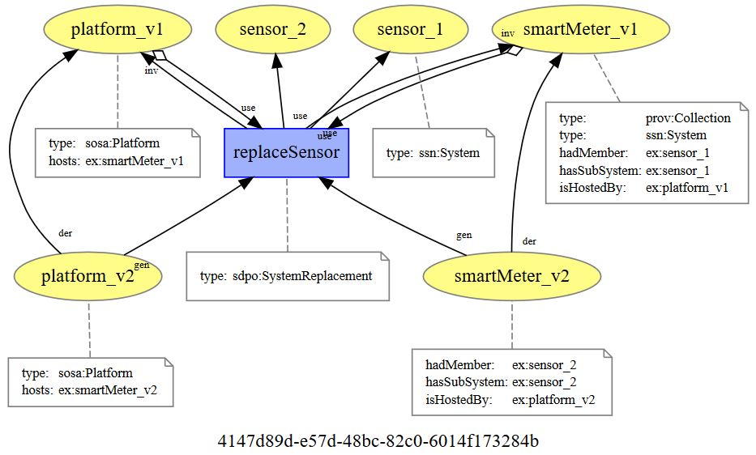

# The System Deployment Provenance Ontology
The System Deployment Provenance Ontology (SDPO) is an extension of the [PROV-O ontology](http://www.w3.org/TR/prov-o/) and the [Semantic Sensor Network Ontology](https://www.w3.org/TR/vocab-ssn/) (SSN) created to describe the activities, entities, and agents that have influenced the deployment of SSN Systems.  [SSN Systems]( https://www.w3.org/TR/vocab-ssn/#SSNSystem) represent pieces of infrastructure that can be composed of subsystems, such as [Sensors]( https://www.w3.org/TR/vocab-ssn/#SOSASensor), [Actuators]( https://www.w3.org/TR/vocab-ssn/#SOSAActuator), and [Samplers](https://www.w3.org/TR/vocab-ssn/#SOSASampler) in a variety of domains, including the Internet of Things.  

SSN describes System [deployments]( https://www.w3.org/TR/vocab-ssn/#SSNDeployment) as the “deployment of one or more Systems for a particular purpose” with refernces to the deployed system and [Platforms](https://www.w3.org/TR/vocab-ssn/#SOSAPlatform) on which Systems are deployed. SDPO extends the information that can be provided about deployments by providing a vocabulary to document the activities that have occurred before and during a deployment.  Here SDPO adopts the PROV-O approach to describe the provenance of a deployment as a record of the activities with associated agents (people, software, etc.) and entities (things used and generated by activities) that have influenced a deployment in some way.  This is achieved by building on the [SOSA PROV Alignment Model]( https://www.w3.org/TR/vocab-ssn/#PROV_Alignment) (the [SOSA ontology](h ttp://www.w3.org/ns/sosa/) provides the core concepts of SSN) and a previous [SSN-PROV-O alignment]( ceur-ws.org/Vol-1401/paper-05.pdf).

In SDPO, SSN Deployments are viewed as PROV-O Activities (which is consistent with the previous SSN-PROV-O alignment).  SDPO defines the [Deployment Related Activity]( https://trustlens.github.io/sdpo/index-en.html#DeploymentRelatedActivity) class, a sub-class of PROV-O Activity, to describe the activities that have occurred at some time prior to, during, or following the deployment of one of more SSN Systems.  SDPO defines several sub-classes of Deployment Related Activity allowing users to describe some of the different types of activities that have occurred.  These includes: installation, calibration, maintenance, and removal of the system; inspections of the area (site) surrounding where a system has been deployed; design of the deployment; and review, validation, quality control, and quality assurance activities of the data generated by a system.  

Along with the ontology, a number of [PROV-Templates]( https://provenance.ecs.soton.ac.uk/prov-template/) are also [available on the github repo]( https://github.com/TrustLens/sdpo/tree/master/prov-templates/templates), which provide suggested provenance patterns for some of the deployment related activities.  In Luc Moreau’s words, PROV-Templates “describing the shape of provenance graphs to be generated” – for more information about PROV-Templates and how to use them with the [ProvToolbox]( http://lucmoreau.github.io/ProvToolbox/) , please see Luc’s two blog posts ([part one]( https://lucmoreau.wordpress.com/2015/07/30/provtoolbox-tutorial-4-templates-for-provenance-part-1/), [part two] (https://lucmoreau.wordpress.com/2015/08/03/provtoolbox-tutorial-4-templates-for-provenance-part-2/)).

## Examples
This section provides some examples of how the deployment of a [smart meter](https://www.smartenergygb.org/en/about-smart-meters/what-is-a-smart-meter) could be described using SDPO. 

### Installation
The following image shows how the installation of a smater meter onto a platform could be described using SDPO, based on the [System Platform Installation template](https://github.com/TrustLens/sdpo/blob/master/prov-templates/templates/SystemPlatformInstallation.provn).  

.

At the center of the image is the *install* activity, a type of [Installation](https://trustlens.github.io/sdpo/index-en.html#Installation) deployment related activity.  This uses the *smartMeter* and *platform* entities describing the smart meter that is being installed and the platform that it is being installed on respectively.  Only minimal information is provided about the smart meter and platform - in reality we would probably need some additional details, such as the manufacturer of the smart meter and the physical location of the platform.   In this provenance record, the *install* activity generates [specialisations](https://www.w3.org/TR/prov-o/#specializationOf) of the smart meter (*smartMeter_v1*) and platform (*platform_v1*).  These new entities share all aspects of the latter (so *smartMeter_v1* still has type ssn:System and *platform_v1* still has type sosa:Platform), and add additional aspects - that *smartMeter_v1* is hosted by *platform_v1* and *platform_v1* hosts *smartMeter_v1*).  

As the installation activity, smart meter, and platform are described using PROv-O, we can add additional provenance information - such as the person that carried out the installation, when it was completed, etc. using standard PROV concepts.  

### Replacing a SubSystem
Consider the scenario where the smart meter has been deployed for a period of time and one of the sensors develops a fault and needs to be replaced. We can model this using the SDPO [System Replacement](https://trustlens.github.io/sdpo/index-en.html#SystemReplacement) activity.  The following image shows how that could be described using the [System Sybsystem Replacement](https://github.com/TrustLens/sdpo/blob/master/prov-templates/templates/SystemSubsystemReplacement.provn) template.

.

There are a couple of things to note about this example:
* SDPO views a SSN System as PROV Collection of subsystems - as per the earlier SSN-PROV-O alignment. Hence *smartMeter_v1* has type prov:Collection (which has member *sensor*) and and ssn:System (which has subsystem *ex:sensor*).
* The *replaceSensor* activity replaces the *sensor_1* subsystem of *smartMeter_v1* with a new sensor, *sensor_2*.  
* Following completion of the *replaceSensor* activity, *sensor_1* is no longer a subsystem of the smart meter - it has been replaced with *sensor_2*.  
* As the components of the smart meter have changed, a new description of the smart meter (*smartMeter_v2*) is created, reflecting the new components.
* As *smartMeter_v2* is now the latest description of the smart meter, the description of the platform (*platform_v1*) is updated to reflect that it now hosts *smartMeter_v2*.  
* *smartMeter_v2* and *platform_v2* are [revisions of](https://www.w3.org/TR/prov-o/#wasRevisionOf) (a special type of derivation), reflecting that part of the original entities (*smartMeter_v1* and *platform_v1*) have changed. 
